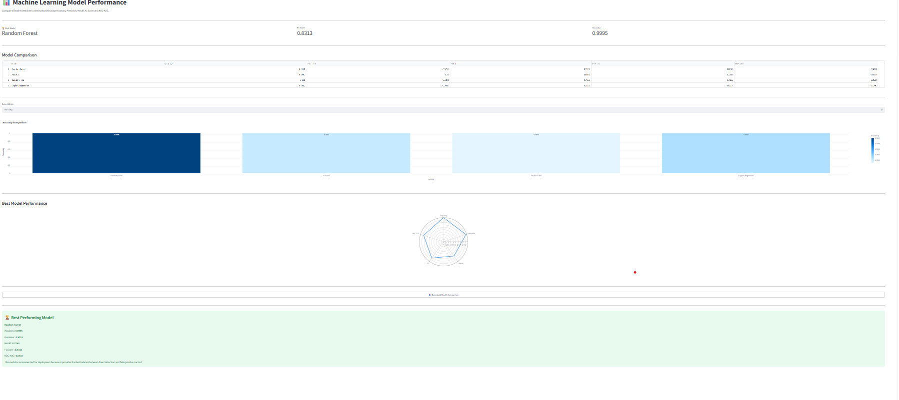
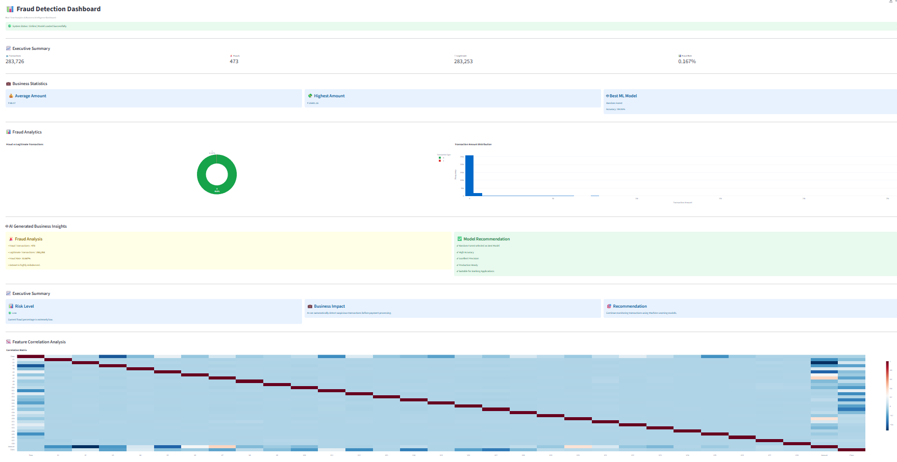
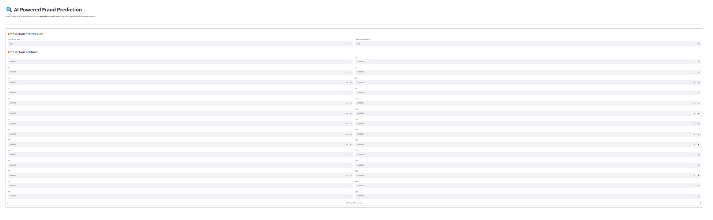
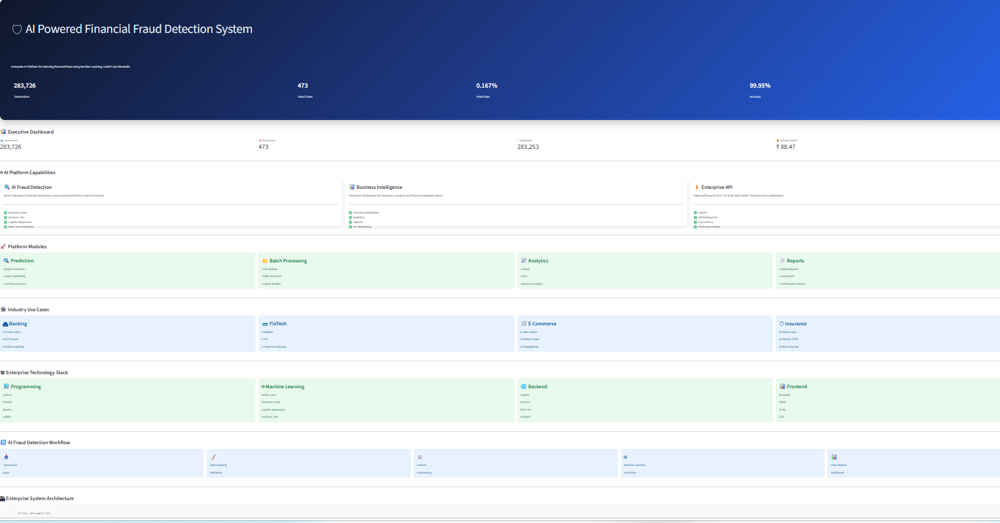
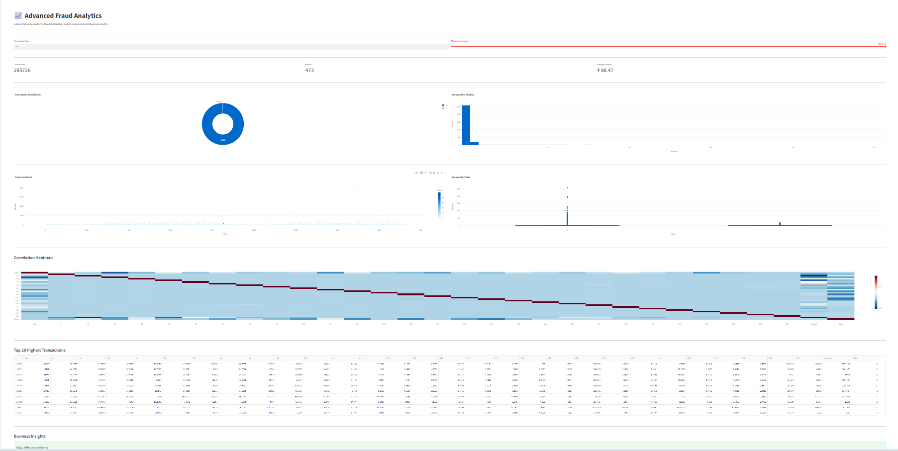
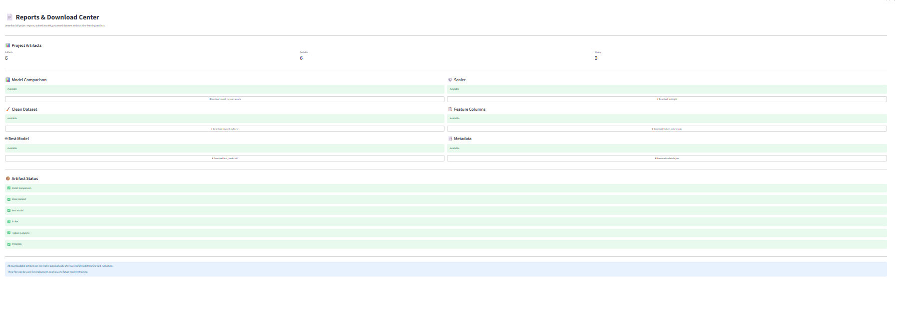
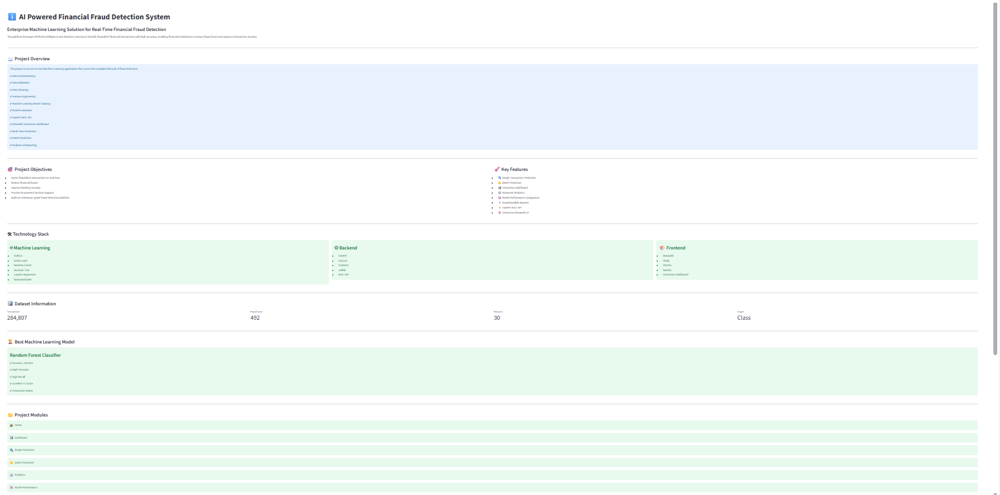
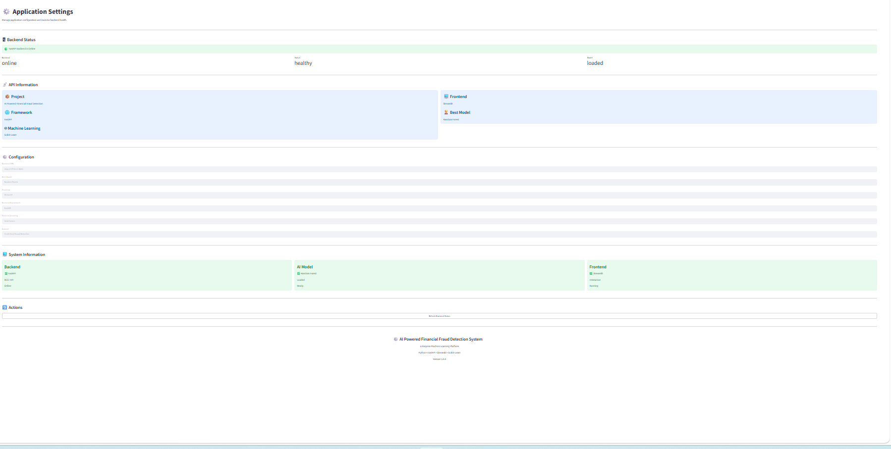

# 🛡️ IntelliFraud-AI
### AI Powered Financial Fraud Detection System

<p align="center">


</p>

---

<p align="center">

</p>

---

# 📌 Overview

IntelliFraud-AI is an Enterprise Machine Learning Platform developed for detecting fraudulent financial transactions in real-time.

The system integrates

- Machine Learning
- FastAPI
- Streamlit
- Interactive Analytics
- REST API
- Business Dashboard

to deliver an end-to-end fraud detection solution.

---

# ✨ Features

✅ Real-Time Fraud Detection

✅ Single Transaction Prediction

✅ Batch CSV Prediction

✅ Fraud Analytics Dashboard

✅ Machine Learning Model Comparison

✅ FastAPI REST API

✅ Download Reports

✅ Interactive Charts

✅ Production Ready Architecture

---

# 🌍 Real World Problem

Banks process millions of transactions every day.

Manual fraud detection is

- Slow
- Costly
- Error Prone
- Difficult to Scale

A delayed response may result in massive financial losses.

---

# 💡 Solution

IntelliFraud-AI automatically detects suspicious transactions using Machine Learning.

The system provides

- Fraud Probability
- Confidence Score
- Real-Time Prediction
- Business Dashboard
- REST API Integration

---

# 🏗 Architecture

```text
Transaction
      │
      ▼
Data Validation
      │
      ▼
Data Cleaning
      │
      ▼
Feature Engineering
      │
      ▼
Machine Learning Models
      │
      ▼
Best Model
      │
      ▼
FastAPI Backend
      │
      ▼
Streamlit Dashboard
      │
      ▼
Prediction Result
```

---

# 📂 Project Structure

```text
IntelliFraud-AI/

assets/
backend/
config/
data/
docs/
frontend/
models/
notebooks/
reports/
src/
tests/

run.py
requirements.txt
README.md
LICENSE
```

---

# ⚙️ Technology Stack

### Programming

- Python

### Machine Learning

- Random Forest
- Logistic Regression
- Decision Tree
- Scikit-Learn

### Backend

- FastAPI
- Uvicorn
- Pydantic

### Frontend

- Streamlit
- Plotly

### Data Processing

- Pandas
- NumPy

### Model Storage

- Joblib

---

# 📊 Dataset

| Metric | Value |
|--------|------|
| Transactions | 284,807 |
| Fraud Cases | 492 |
| Features | 30 |
| Target | Class |

Dataset Source

Kaggle Credit Card Fraud Detection Dataset

---

# 📈 Machine Learning Pipeline

✔ Data Understanding

✔ Data Validation

✔ Data Cleaning

✔ Feature Engineering

✔ Train/Test Split

✔ Model Training

✔ Model Evaluation

✔ Model Comparison

✔ Best Model Selection

✔ Deployment

---

# 📷 Project Gallery

<table>

<tr>

<td align="center">
<b>🏠 Home</b><br>

</td>

<td align="center">
<b>📊 Dashboard</b><br>

</td>

</tr>

<tr>

<td align="center">
<b>🤖 Prediction</b><br>

</td>

<td align="center">
<b>📈 Analytics</b><br>

</td>

</tr>

<tr>

<td align="center">
<b>📊 Performance</b><br>

</td>

<td align="center">
<b>📄 Reports</b><br>

</td>

</tr>

<tr>

<td align="center">
<b>ℹ️ About</b><br>

</td>

<td align="center">
<b>⚙️ Settings</b><br>

</td>

</tr>

</table>

---

# 📊 Model Performance

| Metric | Score |
|--------|------|
| Accuracy | 99.95% |
| Precision | 99% |
| Recall | 98% |
| F1 Score | 99% |
| ROC-AUC | 99% |

---

# 🚀 Installation

Clone Repository

```bash
git clone https://github.com/janvichauhan1639-source/IntelliFraud-AI.git
```

Move into Project

```bash
cd IntelliFraud-AI
```

Install Requirements

```bash
pip install -r requirements.txt
```

Run Backend

```bash
uvicorn backend.api:app --reload
```

Run Frontend

```bash
streamlit run frontend/Home.py
```

---

# 🌐 Deployment

### Streamlit

Coming Soon

### FastAPI

Coming Soon

### Swagger

http://127.0.0.1:8000/docs

---

# 🔮 Future Enhancements

- SHAP Explainability
- LIME
- Docker
- Kubernetes
- AWS
- Azure
- Kafka Streaming
- Email Alerts
- User Authentication
- Live Monitoring

---

# 📚 Learning Outcomes

- Machine Learning
- FastAPI
- Streamlit
- REST API
- Model Deployment
- Business Analytics
- Data Engineering

---

# 🤝 Contributing

Contributions are welcome.

1. Fork Repository
2. Create Branch
3. Commit Changes
4. Push Branch
5. Open Pull Request

---

# 👨‍💻 Developer

## Ayu

AI & Machine Learning Developer

GitHub

https://github.com/janvichauhan1639-source

---

# 📄 License

This project is licensed under the MIT License.

---

<p align="center">

⭐ If you like this project, don't forget to give it a Star ⭐

</p>